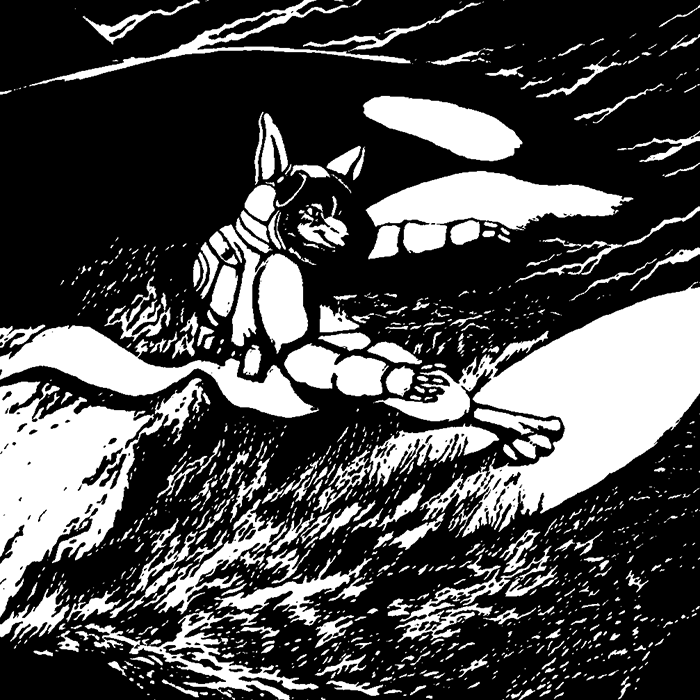

# 🐺dataherd-raika🐺




"Dataherd-raika는 대규모 사용자 행동 데이터셋을 시뮬레이션하기 위해 설계된 라이브러리입니다. 하나의 사용자 이벤트(예: 클릭 또는 키워드 입력)를 취하여 간단한 확률 분포와 사용자 정의 변수를 적용, 광범위한 데이터셋으로 확장합니다."

<br/>

"Dataherd-Raika is a cutting-edge library designed to simulate large-scale user behavior datasets. It takes a single user event (like a click or keyword input) and, by applying simple probability distributions and custom variables, expands it into a vast dataset."

## 🐺사용법 및 예상 결과 : How to Use and Expected Results🐺

### 1. 시작 및 종료 시간 설정: Setting Start and End Time

```javascript
setTimestampRange(new Date('2024-01-01T00:00:00'), new Date('2024-01-01T08:00:00'));
```

- 이 함수는 이벤트 타임스탬프를 생성할 때 사용되는 시간 범위를 설정합니다. 2024-01-01 자정 ~ 오전 8시 사이의 랜덤한 타임스탬프를 생성하고 싶다면, 위 코드처럼 설정하면 됩니다.

<br/>

- This function sets the time range used for generating event timestamps. To create random timestamps between midnight and 8 AM on 2024-01-01, set it as shown in the code above.

### 2. 클릭 이벤트 & 특정 키워드 이벤트 횟수 조정: Adjusting Click Event & Specific Keyword Event Counts

```javascript
setUserClickCount(25);
setUserKeywordCount(25);
```

- 이 함수들은 사용자가 클릭하거나, 키워드를 생성/검색할 때마다, 적용되는 카운트, 만들어지는 데이터 수를 설정합니다.

<br/>

- These functions set the count of data generated each time a user clicks or creates/searches a keyword.

### 3. 커스텀 데이터 설정: Setting Custom Data

```typescript
//커스텀 데이터 항목 타입, Custom data type
export type UserDefinedItem = {
    
    name: string; // 항목명: 데이터 항목 이름을 정합니다.
                  // Item Name: Set the name of the data item.

    type: 'number' | 'string' | 'boolean' | 'array' | 'object'; // 타입: 숫자 / 문자 / boolean / 배열 / 객체
                                                                // Type: Number / String / Boolean / Array / Object

    ❗ type: 'number';   // 1 ~ 10 사이에서 랜덤한 값이 선택됩니다. distribution, mean, standardDeviation 옵션을 사용할 수 있습니다.
    ❗ options: [1, 10]; // Random value is selected between 1 and 10. The distribution, mean, and standard deviation options are available.

    distribution?: 'uniform' | 'normal'; //확률 분포 타입: uniform: 완전 랜덤, normal: 정규 분포(가우스 분포)
                                        // Distribution Type: Uniform: Completely random, Normal: Gaussian distribution

    mean?: number;  //평균값 설정 (디폴트: 중간값),
                    // Mean: Set the average value (default: median)
    
    standardDeviation?: number; //표준편차 설정 (디폴트: 6시그마),
                                // Standard Deviation: Set the standard deviation (default: 6 sigma)
    
    options?: number | string | number[] | string[] | UserDefinedItem[] | object; //options의 타입을 명시적으로 정의 
                                                                                  //Explicitly define the type of options

    randomizeArrays?: boolean; //배열 항목의 랜덤 선택 여부 (디폴트: false)
                               //Whether to randomly select array items (default: false)
                               
    randomizeObjects?: boolean; //객체 항목의 랜덤 선택 여부 (디폴트: false)
                                //Whether to randomly select object items (default: false)

    selectionProbability?: boolean; //'문자열 그룹', '배열', '객체' 항목의 랜덤 선택 시, 특정 항목(들)이 선택될 확률 조정 여부 (디폴트: false)
                                    //Adjust the probability of selecting certain items during random selection of 'string group', 'array', 'object' items (default: false)
    
    probabilitySetting?: ProbabilitySetting[]; // selectionProbability: true일 시, 특정 항목(들)의 확률 설정 
                                               // When selectionProbability is true, set the probability of specific items

    arraySelectionCount?: number; //배열에서 선택할 항목 수 (디폴트: 1) 
                                  //Number of items to select from an array (default: 1)

    objectSelectionCount?: number; //객체에서 선택할 항목 수 (디폴트: 1) 
                                   //Number of items to select from an object (default: 1)

    randomizeSelectionCount?: boolean; //선택한 항목 수 내에서 무작위 선택 여부 (ex: 선택 항목: 3일 시, 1개 ~ 3개의 항목이 선택될 수 있음.) (디폴트: 1)
                                       // Whether to randomly select within the chosen number of items 
                                       // (e.g., If selection items: 3, then 1 to 3 items can be selected.) (default: 1)
};
```

### 사용법: How To Use

❗주의: name, type, options, 확률 정의 및 설계를 정확히 하십시오.❗

<br/>

❗Caution: Ensure the definition and design of name, type, options, and probability are accurate.❗


```typescript
const UserDefinedItems: UserDefinedItem[] = [
    // 전역 커스텀 데이터 항목들
    { name: 'age', type: 'number', options: [10, 50], distribution: 'uniform'},
    { name: 'job', type: 'string', options: ['student', 'web developer', 'accountant'] },
    { name: 'salary', type: 'number', options: [25000, 100000], distribution: 'normal', mean: 36000, standardDeviation: (100000 - 25000) / 6 },
    { name: 'drinks', type: 'array', options: ['Americano', 'Latte', 'Cappuccino', 'Green Tea Latte'], randomizeArrays: true },
    { name: 'hobbies', type: 'object', options: { hobby1: 'reading', hobby2: 'gaming', hobby3: 'coding', hobby4: 'hiking' }, randomizeObjects: true }
]);
```

```typescript
const UserDefinedItems: UserDefinedItem[] = [
    {
        name: 'job',
        type: 'array',
        options:[
                    {
                        name: 'student',
                        type: 'array',
                        options: [
                            {
                                name: 'age',
                                type: 'number',
                                options: [10, 30]
                            },
                            {
                                name: 'salary',
                                type: 'number',
                                options: [8000, 20000]
                            }
                        ]
                    },
                    {
                        name: 'developer',
                        type: 'array',
                        options: [
                            {
                                name: 'age',
                                type: 'number',
                                options: [20, 60]
                            },
                            {
                                name: 'salary',
                                type: 'number',
                                distribution: 'normal',
                                mean: 50000,
                                options: [40000, 100000]
                            }
                        ]
                    },
                    {
                        name: 'accountant',
                        type: 'array',
                        options: [
                            {
                                name: 'age',
                                type: 'number',
                                options: [20, 60]
                            },
                            {
                                name: 'salary',
                                type: 'number',
                                distribution: 'normal',
                                mean: 50000,
                                options: [40000, 100000]
                            }
                        ]
                    }
                ],
        randomizeArrays: true,
        selectionProbability: true,
        probabilitySettings: [
            { identifier: 0, probability: 10 }, //(10%: student)
            { identifier: 1, probability: 45 }, //(45%: developer)
            { identifier: 2, probability: 45 }, //(45%: accountant)
        ]
    },
    {
        name: 'favorite drinks',
        type: 'array',
        options: ['Americano', 'Latte', 'Cappuccino', 'Green Tea Latte'],
        randomizeArrays: true
    },
    {
        name: 'hobbies',
        type: 'object',
        options: { hobby1: 'reading', hobby2: 'gaming', hobby3: 'coding', hobby4: 'hiking' },
        randomizeObjects: true,
        objectSelectionCount: 3,
        randomizeSelectionCount: true   
    }
];
```

### 예상 결과: Expected Results

- 커스텀 데이터가 이벤트 데이터에 포함됩니다. 예를 들어, 사용자의 나이, 직업, 연봉, 선호 음료, 취미 등이 데이터에 포함될 수 있습니다.

<br/>

- Custom data is included in the event data. For example, user information such as age, job, salary, preferred drinks, and hobbies can be included in the data.


```json
{
    "eventType": "click",
    "timestamp": "2024-01-01T19:40:47.615Z",
    "clickCount": 1,
    "job": [
        {
            "developer": [
                {
                    "age": 30
                },
                {
                    "salary": 55220
                }
            ]
        }
    ],
    "favorite drinks": [
        "Americano"
    ],
    "hobbies": {
        "hobby1": "reading",
        "hobby3": "coding"
    }
}
```


### 4. 전역 & 로컬 커스텀 데이터 그룹 설정: Setting Global & Local Custom Data Groups

- 전역 커스텀 데이터는 모든 이벤트 유형에 공통적으로 적용되는 데이터를 정의합니다.
- 로컬 커스텀 데이터는 특정 이벤트 유형에만 적용되는 데이터를 정의합니다.
- 이를 통해 사용자의 상호작용을 더 세밀하게 추적하고 분석할 수 있습니다.

<br/>

- Global custom data defines data that is common to all event types.
- Local custom data defines data that applies only to specific event types.
- This allows for more detailed tracking and analysis of user interactions.

### 사용법: How To Use

#### 전역 커스텀 데이터: Global Custom Data

```javascript

// 설정한 UserDefinedItems를 사용
setGlobalUserDefinedItems(UserDefinedItems);


```

- 전역 커스텀 데이터는 애플리케이션의 모든 이벤트에서 공통적으로 사용됩니다. setGlobalUserDefinedItems 함수를 사용하여 전역 데이터 항목을 설정할 수 있습니다. 예를 들어, 사용자의 직업, 연령대 등과 같은 일반적인 정보를 전역 데이터로 설정할 수 있습니다.

<br/>

- Global custom data is used across all events in the application. The setGlobalUserDefinedItems function allows you to set global data items. For example, general information such as a user's job or age group can be set as global data.


#### 로컬 커스텀 데이터: Local Custom Data

```javascript

setLocalCustomDataGroup('clickEventCategoryA', [
    { name: 'categoryA-specific', type: 'string', options: ['Option1', 'Option2'] }
]);

setLocalCustomDataGroup('clickEventCategoryB', [
    { name: 'categoryB-specific', type: 'number', options: [1, 10] }

]);
```

- 로컬 커스텀 데이터는 특정 이벤트에만 적용됩니다. 예를 들어, 특정 클릭 이벤트에만 적용되는 데이터를 정의할 때 사용합니다. setLocalCustomDataGroup 함수를 통해 각 이벤트 카테고리별로 다른 데이터를 설정할 수 있습니다.

<br/>

- Local custom data applies only to specific events. For example, it's used to define data that applies only to certain click events. The setLocalCustomDataGroup function allows you to set different data for each event category.


### 5. 클릭 이벤트 리스너 설정/ 클릭 이벤트 추적 함수 사용: Setting Click Event Listeners / Using Click Event Tracking Function


trackClickEvent 함수와 trackKeywordEvent 함수는 웹페이지나 애플리케이션에서 사용자의 클릭과 키워드 이벤트를 추적하는 데 사용되는 함수들입니다.
이들은 이러한 상호작용과 관련된 데이터를 수집하고 관리하여, 분석, 사용자 경험 개선 또는 다양한 목적으로 사용할 수 있습니다.
각 함수의 구성과 사용법을 자세히 살펴봅시다.

<br/>

The trackClickEvent and trackKeywordEvent functions are used to track user click and keyword events on web pages or applications. They collect and manage data related to these interactions for analysis, user experience improvement, or various other purposes. Let's take a closer look at the configuration and usage of each function.


#### trackClickEvent Function


- 매개변수:

1. event: 사용자 상호작용에서 발생하는 자바스크립트 Event 객체 (예: 마우스 클릭).
2. eventType: 이벤트를 분류하는 문자열 (예: 'button_click', 'nav_click').
3. includeLocalCustomData: 이 이벤트 유형에 특정한 로컬 커스텀 데이터를 포함할지 결정하는 여부. (true/false)
4. includeGlobalCustomData: 전역적으로 정의된 커스텀 데이터를 포함할지 결정하는 여부. (true/false)
5. callback: 이벤트 데이터를 수집한 후 호출될 함수. 옵션으로 선택 가능.

<br/>

- Parameters:

1. event: JavaScript Event object occurring from user interaction (e.g., mouse click).
2. eventType: String categorizing the event (e.g., 'button_click', 'nav_click').
3. includeLocalCustomData: Whether to include local custom data specific to this event type. (true/false)
4. includeGlobalCustomData: Whether to include globally defined custom data. (true/false)
5. callback: An optional function to be called after collecting event data.

<br/>
<br/>

- 작동 방식:

함수는 정의된 횟수(userDefinedClickCount)만큼 클릭 이벤트 데이터를 생성합니다.
이벤트 유형, 지정된 범위 내의 랜덤 타임스탬프, 클릭 횟수를 캡처합니다.

includeLocalCustomData 또는 includeGlobalCustomData가 참이면, 이 이벤트 유형에 지역적으로 혹은 전역적으로 정의된 커스텀 데이터도 포함됩니다.

옵션으로, 이벤트 데이터는 제공된 callback 함수에 전달됩니다.

<br/>

- How It Works:

The function generates click event data for the defined number of times (userDefinedClickCount).
It captures the event type, random timestamps within a specified range, and click count.

If includeLocalCustomData or includeGlobalCustomData is true, the respective custom data is also included.

Optionally, the event data is passed to the provided callback function.

<br/>
<br/>

- 목적:
사용자 클릭 이벤트를 추적하고 관련 데이터를 수집합니다.
표준 및 커스텀 데이터를 캡처하는 유연성을 제공합니다.
콜백을 통해 이 데이터의 사후 처리 또는 처리를 가능하게 합니다.

<br/>

- Purpose:
Tracks user click events and collects related data.
Provides flexibility in capturing standard and custom data.
Enables post-processing or handling of this data through a callback.

### 사용법: How To Use

```javascript
document.getElementById('elementA').addEventListener('click', (event) => {
    trackClickEvent(event, 'clickEventCategoryA', true, false);
});
document.getElementById('elementB').addEventListener('click', (event) => {
    trackClickEvent(event, 'clickEventCategoryB', false, true);
});
```

### 예상 결과: Expected Results

- elementA 클릭 시

로컬 커스텀 데이터(clickEventCategoryA 그룹에 정의된 데이터)가 클릭 이벤트 데이터에 포함되어 전송됩니다.
이 데이터는 trackClickEvent 함수의 세 번째 매개변수로 true를 지정하여 로컬 커스텀 데이터를 포함하도록 (전역 커스텀 데이터 포함 여부: false) 설정합니다.

<br/>

- On Clicking elementA

Local custom data (defined in the clickEventCategoryA group) is included and sent with the click event data.
This data is set to be included (with global custom data set to false) by specifying true as the third parameter in the trackClickEvent function.

```json
{
    "eventType": "click",
    "elementId": "elementA",
    "timestamp": "2024-01-01T02:30:00.000Z",
    "clickCount": 1,
    "localCustomData": {
        "categoryA-specific": "Option1"
    }
}
```

- elementB 클릭 시

전역 커스텀 데이터(GlobalUserDefinedItems에 정의된 데이터)가 클릭 이벤트 데이터에 포함되어 전송됩니다.
이 데이터는 trackClickEvent 함수의 네 번째 매개변수로 true를 지정하여 전역 커스텀 데이터를 포함하도록 (지역 커스텀 데이터 포함 여부: false) 설정합니다.

<br/>

- On Clicking elementB

Global custom data (defined in GlobalUserDefinedItems) is included and sent with the click event data.
This data is set to be included (with local custom data set to false) by specifying true as the fourth parameter in the trackClickEvent function.

```json
{
    "eventType": "click",
    "elementId": "elementB",
    "timestamp": "2024-01-01T03:45:00.000Z",
    "clickCount": 1,
    "globalCustomData": {
        "age": 30,
        "job": "accountant",
        "salary": 55000,
        "drinks": ["Cappuccino"],
        "hobbies": {"hobby1": "coding", "hobby2": "hiking"}
    }
}
```


### 6. 키워드 이벤트 추적 함수 사용: Using Keyword Event Tracking Function

- 매개변수:

1. keyword: 이벤트와 관련된 키워드.
2. eventType: 이벤트를 분류하는 문자열 (예: 'search_keyword').
3. includeLocalCustomData: 이 이벤트 유형에 특정한 로컬 커스텀 데이터를 포함할지 결정하는 여부. (true/false)
4. includeGlobalCustomData: 전역적으로 정의된 커스텀 데이터를 포함할지 결정하는 여부. (true/false)
5. repeatCount: 키워드 이벤트가 발생하는 진짜 횟수. (해당 값과 키워드 이벤트 카운트 값을 비교 분석하여, 도배글 작성과 같이 특정 키워드가 비정상적으로 반복되는 사항을 필터링할 수 있습니다.)
5. callback: 이벤트 데이터를 수집한 후 호출될 함수. 옵션으로 선택 가능.

<br/>

- Parameters:

1. keyword: The keyword associated with the event.
2. eventType: String categorizing the event (e.g., 'search_keyword').
3. includeLocalCustomData: Whether to include local custom data specific to this event type. (true/false)
4. includeGlobalCustomData: Whether to include globally defined custom data. (true/false)
5. repeatCount: The actual number of times the keyword event occurs. (This can be used to filter out abnormal repetitions of specific keywords, like spamming.)
6. callback: An optional function to be called after collecting event data.

<br/>
<br/>

- 작동 방식:

함수는 지정된 횟수(userDefinedKeywordCount)만큼 키워드 이벤트 데이터를 생성합니다.
키워드, 이벤트 유형, 랜덤 타임스탬프, 키워드 발생 횟수를 캡처합니다.
includeLocalCustomData 또는 includeGlobalCustomData가 선택되면 추가 커스텀 데이터가 포함됩니다.
수집된 데이터는 제공된 callback 함수에 전달됩니다.

<br/>

- How It Works:

The function generates keyword event data for the specified number of times (userDefinedKeywordCount).
It captures the keyword, event type, random timestamp, and the occurrence count of the keyword.
If includeLocalCustomData or includeGlobalCustomData is selected, additional custom data is included.
The collected data is passed to the provided callback function.

<br/>
<br/>

- 목적:

사용자가 입력한 키워드와 관련된 이벤트를 추적합니다.
이러한 이벤트에 대한 자세한 데이터를 수집합니다.
콜백을 통해 이벤트 사후 처리 또는 작업을 가능하게 합니다.

<br/>

- Purpose:

Tracks events related to keywords entered by users.
Collects detailed data on these events.
Enables post-event processing or tasks through a callback.


### 사용법: How To Use

```javascript
function simulateKeywordEvent() {
    const keyword = "exampleKeyword";
    trackKeywordEvent(keyword, 'search', true, 1, true);
}

simulateKeywordEvent();
```

### 예상 결과: Expected Results

- 키워드 이벤트가 추적되며, 해당 이벤트에 관련된 데이터가 포함됩니다.

<br/>

- The keyword event is tracked, and data related to the event is included.

```json
{
    "keyword": "exampleKeyword",
    "eventType": "search",
    "timestamp": "2024-01-01T04:00:00.000Z",
    "keywordCount": 1,
    "repeatCount": 1,
    "age": 32,
    "job": "developer",
    "salary": 30000,
    "drinks": ["Green Tea Latte"],
    "hobbies": {"hobby1": "gaming"}
}
```


### 7. 서버 데이터 저장: Saving Data to Server

이벤트 추적 함수(trackClickEvent 또는 trackKeywordEvent)에 콜백 함수를 전달하여, 이벤트 데이터를 서버로 전송할 수 있습니다. 
이 콜백 함수는 이벤트 데이터를 받아 서버 API 엔드포인트로 전송하는 로직을 포함합니다.

<br/>

Event tracking functions (trackClickEvent or trackKeywordEvent) can send event data to the server by passing a callback function. This callback function includes logic for sending event data to a server API endpoint.

### 사용법: How To Use

```typescript
    //키워드 이벤트를 서버로 보내기 위한 콜백 함수 정의
    // Define a callback function to send keyword events to the server
    const sendKeywordEventToServer = async (eventData: { [key: string]: KeywordEventData }) => {
        try {
            await fetch('/api/save-event-data', {
                method: 'POST',
                body: JSON.stringify(eventData),
                headers: {'Content-Type': 'application/json'}
            });
        } catch (error) {
            console.error('Error sending eventdata', error);
        }       
    }

    //클릭 이벤트를 서버로 보내기 위한 콜백 함수 정의
    // Define a callback function to send click events to the server
    const sendClickEventToServer = async (eventData: { [key: string]: ClickEventData }) => {
        try {
            await fetch('/api/save-event-data', {
                method: 'POST',
                body: JSON.stringify(eventData),
                headers: {'Content-Type': 'application/json'}
            });
        } catch (error) {
            console.error('Error sending eventdata', error);
        }       
    }

```

### 예상 결과: Expected Results

- 위의 콜백 함수를 사용하여 이벤트 추적 시, 다음과 같은 흐름으로 데이터가 처리됩니다:

1. 사용자의 클릭 또는 키워드 입력 이벤트가 발생합니다.
2. trackClickEvent 또는 trackKeywordEvent 함수가 호출되며, 이벤트 데이터가 생성됩니다.
3. 생성된 이벤트 데이터는 콜백 함수 sendEventToServer로 전달됩니다.
4. sendEventToServer 함수는 이벤트 데이터를 JSON 형식으로 변환하여 서버의 API 엔드포인트(/api/save-event-data)로 POST 요청을 보냅니다.
5. 서버는 요청을 받아 처리하고, 데이터를 db.json 파일이나 다른 데이터 스토리지에 저장합니다.

이러한 프로세스는 사용자의 상호작용을 실시간으로 추적하고, 데이터를 중앙 서버에 저장하여 분석하는 데 사용될 수 있습니다.
예를 들어, 웹사이트 사용성 개선, 사용자 경험 분석, 사용자 행동에 대한 인사이트 획득 등에 활용할 수 있습니다.

데이터는 JSON 형식으로 저장되므로, 데이터 분석 도구나 대시보드에 쉽게 통합하여 시각화하고 분석할 수 있습니다. 
예를 들어, Google Analytics, Google BigQuery, AWS QuickSight 등 다양한 플랫폼과의 통합이 가능합니다.

<br/>

- Using the above callback functions for event tracking, the data is processed as follows:

1. A user click or keyword input event occurs.
2. The trackClickEvent or trackKeywordEvent function is called, generating event data.
3. The generated event data is passed to the callback function sendEventToServer.
4. The sendEventToServer function converts the event data into JSON format and sends a POST request to the server's API endpoint (/api/save-event-data).
5. The server receives and processes the request, storing the data in a db.json file or other data storage.

This process can be used to track user interactions in real-time, store data in a central server for analysis, and can be utilized for various purposes such as improving website usability, analyzing user experience, and gaining insights into user behavior.

Since the data is stored in JSON format, it can be easily integrated, visualized, and analyzed with data analysis tools or dashboards. For example, it can be integrated with various platforms such as Google Analytics, Google BigQuery, AWS QuickSight, etc.

### 종합: Summary

이러한 방식으로 사용자 이벤트 데이터를 추적하고 관련 데이터를 수집 및 분석할 수 있습니다.
해당 라이브러리는 웹사이트나 애플리케이션의 사용성 개선, 사용자 경험 최적화 등에 활용될 수 있습니다.

<br/>

This approach allows for the tracking and analysis of user event data. The library can be used to improve usability and optimize user experience in websites and applications.